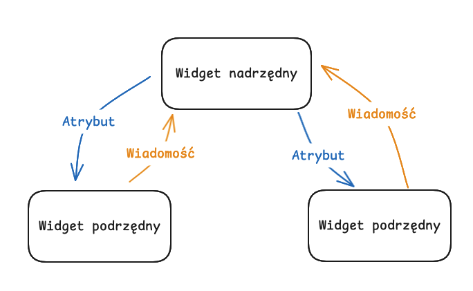
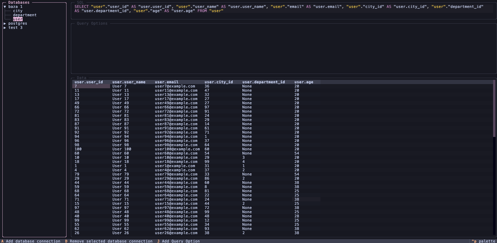

# Projekt - Technologie obiektowe

## Temat: Graficzne narzędzie do tworzenia zapytań

Wykonano przez: Marcin Konwiak

## Wstęp
Query-by-Example charakteryzuje się wizualnym podejściem do pobierania danych z baz. Zamiast pisać skomplikowane zapytania tekstowe (jak w języku SQL), użytkownik wypełnia graficzny formularz lub szablon, który przypomina strukturę danych, jakie chce uzyskać.

### 1. Prezentacja szablonu
System pokazuje użytkownikowi graficzną reprezentację tabel z bazy danych.
### 2. Wypełnianie szablonu 
Użytkownik wpisuje w odpowiednie pola przykładowe wartości lub warunki, które mają spełniać dane wynikowe.
Na przykład aby znaleźć wszystkich klientów z Kielc, w kolumnie Miasto tabeli Klienci wpisuje się "Kielce".
### 3. Tłumaczenie na zapytanie
System w tle tłumaczy wizualne kryteria na zapytanie SQL.
### 4. Wyświetlenie wyników
Baza danych zwraca wyniki, które pasują do podanych przez użytkownika przykładów i warunków.

Przykładem takiego oprogramowania jest Microsoft Access.

## Opis aplikacji

Do utworzenia aplikacji, która umożliwi tworzenie graficznych zapytań do baz danych użyto języka programowania python oraz biblioteki Textual.
Aplikacja jest przeznaczona do użytkowania w terminalu oraz przeglądarce.
Aplikacja łączy się z bazami danych PostgreSQL.

Aplikacja umożliwia tworzenia zapytań uwzględniając:
- SELECT
- WHERE
- LEFT JOIN
- INNER JOIN
- ORDER BY
- Operacje grupujące: AVG, SUM, COUNT, MIN, MAX

## Architektura aplikacji

Biblioteka Textual pozwala na tworzenie aplikacji składających się z widgetów.
Architektura aplikacji została oparta na zasadzie "atrybuty w dół, wiadomości w górę".
Oznacza to, że widget może aktualizować element podrzędny, ustawiając jego atrybuty lub wywołując jego metody, ale widgety powinny wysyłać wiadomości tylko do swojego rodzica.

## Prezentacja aplikacji

